# 🗂️ ABY-MED Platform - Entity Relationship Diagram

**Generated:** November 16, 2025  
**Database:** PostgreSQL 15  
**Schema Version:** Phase 1 Complete

---

## 📊 Complete ER Diagram

```mermaid
erDiagram
    %% ============================================================================
    %% CORE ORGANIZATIONS MODULE
    %% ============================================================================
    
    ORGANIZATIONS {
        uuid id PK
        text name
        text org_type "manufacturer|distributor|dealer|hospital|service_provider"
        text status "active|inactive|suspended"
        text external_ref
        jsonb metadata
        timestamptz created_at
        timestamptz updated_at
    }
    
    ORGANIZATION_FACILITIES {
        uuid id PK
        uuid org_id FK
        text facility_name
        text facility_code
        text facility_type "manufacturing|warehouse|service_center|showroom|hospital"
        jsonb address
        point geo_location
        text capacity
        jsonb operational_hours
        text_array services_offered
        text_array equipment_types
        int service_radius_km
        text_array coverage_pincodes
        text_array coverage_states
        text status
        date operational_since
        jsonb metadata
        timestamptz created_at
        timestamptz updated_at
    }
    
    ORG_RELATIONSHIPS {
        uuid id PK
        uuid parent_org_id FK
        uuid child_org_id FK
        text rel_type "manufacturer_of|distributor_of|dealer_of|supplier_of"
        text relationship_status
        date start_date
        date end_date
        boolean auto_renew
        boolean exclusive
        uuid territory_id FK
        numeric commission_percentage
        jsonb payment_terms
        numeric credit_limit
        numeric annual_target
        text performance_tier
        int priority_level
        text contract_reference
        jsonb metadata
        timestamptz created_at
        timestamptz updated_at
    }
    
    TERRITORIES {
        uuid id PK
        text name
        text code
        text coverage_type
        text_array states
        text_array cities
        text_array districts
        text_array pincodes
        jsonb custom_boundaries
        uuid parent_territory_id FK
        uuid assigned_to_org_id FK
        uuid assigned_to_facility_id FK
        numeric estimated_market_size
        int potential_customers
        jsonb metadata
        timestamptz created_at
        timestamptz updated_at
    }
    
    CONTACT_PERSONS {
        uuid id PK
        uuid org_id FK
        text name
        text designation
        text department
        text email
        text primary_phone
        text alternate_phone
        text whatsapp_number
        boolean is_primary
        boolean can_approve_orders
        boolean can_raise_tickets
        text preferred_contact_method
        text_array language_preferences
        boolean active
        timestamptz created_at
        timestamptz updated_at
    }
    
    ORGANIZATION_CERTIFICATIONS {
        uuid id PK
        uuid org_id FK
        uuid facility_id FK
        text certification_type "ISO|CE|FDA"
        text certification_number
        text issued_by
        date issue_date
        date expiry_date
        text status
        text certificate_document_url
        text verification_url
        text scope
        text_array applicable_products
        timestamptz created_at
        timestamptz updated_at
    }
    
    %% ============================================================================
    %% ENGINEER MANAGEMENT MODULE
    %% ============================================================================
    
    ENGINEERS {
        uuid id PK
        text employee_id
        text full_name
        text first_name
        text last_name
        text email
        text phone
        text whatsapp_number
        uuid org_id FK
        text org_type
        text employment_type "full_time|part_time|contractor"
        date joining_date
        uuid primary_facility_id FK
        boolean mobile_engineer
        point current_location
        int coverage_radius_km
        text_array coverage_pincodes
        text_array coverage_cities
        text_array coverage_states
        text home_region
        text status "available|busy|on_leave|off_duty"
        int active_tickets
        int max_daily_tickets
        jsonb working_hours
        boolean on_call_24x7
        int total_tickets_resolved
        numeric avg_resolution_time_hours
        numeric customer_rating
        numeric first_time_fix_rate
        text preferred_contact_method
        text_array language_preferences
        text_array skills
        jsonb metadata
        timestamptz created_at
        timestamptz updated_at
    }
    
    ENGINEER_SKILLS {
        uuid id PK
        uuid engineer_id FK
        text skill_type
        text equipment_category
        text equipment_type
        text_array equipment_models
        uuid manufacturer_id FK
        text manufacturer_name
        boolean manufacturer_authorized
        text proficiency_level "beginner|intermediate|advanced|expert"
        text certification_name
        text certification_number
        text certification_authority
        date certified_date
        date expiry_date
        text certificate_document_url
        boolean can_install
        boolean can_calibrate
        boolean can_repair
        boolean can_train_users
        int years_of_experience
        int tickets_resolved_for_this_skill
        boolean verified
        text verified_by
        date verified_date
        jsonb metadata
        timestamptz created_at
        timestamptz updated_at
    }
    
    ENGINEER_AVAILABILITY {
        uuid id PK
        uuid engineer_id FK
        date date
        boolean available
        text reason
        text notes
        jsonb available_slots
        jsonb blocked_slots
        timestamptz created_at
        timestamptz updated_at
    }
    
    ENGINEER_ASSIGNMENTS {
        uuid id PK
        uuid engineer_id FK
        uuid ticket_id FK
        uuid equipment_id FK
        uuid assigned_by
        timestamptz assigned_at
        text assignment_type "auto|manual"
        text status "assigned|accepted|en_route|on_site|completed"
        timestamptz accepted_at
        timestamptz en_route_at
        timestamptz reached_site_at
        timestamptz work_started_at
        timestamptz work_completed_at
        point engineer_start_location
        point customer_location
        numeric travel_distance_km
        timestamptz estimated_arrival
        timestamptz actual_arrival
        text issue_description
        text diagnosis
        text actions_taken
        jsonb parts_used
        text customer_signature
        int customer_rating
        text customer_feedback
        text_array before_photos
        text_array after_photos
        jsonb metadata
        timestamptz created_at
        timestamptz updated_at
    }
    
    %% ============================================================================
    %% EQUIPMENT REGISTRY MODULE
    %% ============================================================================
    
    EQUIPMENT {
        varchar id PK
        varchar qr_code
        varchar serial_number
        varchar equipment_id
        varchar equipment_name
        varchar manufacturer_name
        varchar model_number
        varchar category
        varchar customer_id
        varchar customer_name
        text installation_location
        jsonb installation_address
        date installation_date
        varchar contract_id
        date purchase_date
        decimal purchase_price
        date warranty_expiry
        varchar amc_contract_id
        varchar status "operational|down|under_maintenance|decommissioned"
        date last_service_date
        date next_service_date
        int service_count
        jsonb specifications
        jsonb photos
        jsonb documents
        text qr_code_url
        bytea qr_code_image
        uuid manufacturer_org_id FK
        uuid sold_by_dealer_id FK
        uuid owned_by_org_id FK
        uuid installed_facility_id FK
        text notes
        timestamptz created_at
        timestamptz updated_at
        varchar created_by
    }
    
    %% ============================================================================
    %% SERVICE TICKETS MODULE
    %% ============================================================================
    
    SERVICE_TICKETS {
        varchar id PK
        varchar ticket_number
        varchar equipment_id FK
        varchar qr_code
        varchar serial_number
        varchar equipment_name
        varchar customer_id
        varchar customer_name
        varchar customer_phone
        varchar customer_whatsapp
        varchar issue_category
        text issue_description
        varchar priority "critical|high|medium|low"
        varchar severity
        varchar source "whatsapp|web|phone|email|scheduled"
        varchar source_message_id
        varchar assigned_engineer_id
        varchar assigned_engineer_name
        timestamptz assigned_at
        varchar status "new|assigned|in_progress|on_hold|resolved|closed|cancelled"
        timestamptz created_at
        timestamptz acknowledged_at
        timestamptz started_at
        timestamptz resolved_at
        timestamptz closed_at
        timestamptz sla_response_due
        timestamptz sla_resolution_due
        boolean sla_breached
        text resolution_notes
        jsonb parts_used
        decimal labor_hours
        decimal cost
        jsonb photos
        jsonb videos
        jsonb documents
        varchar amc_contract_id
        boolean covered_under_amc
        uuid assigned_engineer_id_uuid FK
        int assignment_tier
        text assignment_tier_name
        timestamptz updated_at
        varchar created_by
    }
    
    TICKET_COMMENTS {
        varchar id PK
        varchar ticket_id FK
        varchar comment_type "customer|engineer|internal|system"
        varchar author_id
        varchar author_name
        text comment
        jsonb attachments
        timestamptz created_at
    }
    
    TICKET_STATUS_HISTORY {
        varchar id PK
        varchar ticket_id FK
        varchar from_status
        varchar to_status
        varchar changed_by
        timestamptz changed_at
        text reason
    }
    
    %% ============================================================================
    %% PROCUREMENT MODULE (RFQ, QUOTE, COMPARISON, CONTRACT)
    %% ============================================================================
    
    RFQS {
        uuid id PK
        text rfq_number
        uuid requesting_org_id FK
        text status
        jsonb items
        date expected_response_date
        jsonb metadata
        timestamptz created_at
        timestamptz updated_at
    }
    
    QUOTES {
        uuid id PK
        uuid rfq_id FK
        uuid supplier_org_id FK
        text quote_number
        text status
        jsonb line_items
        numeric total_amount
        text currency
        jsonb terms
        timestamptz created_at
        timestamptz updated_at
    }
    
    COMPARISONS {
        uuid id PK
        uuid rfq_id FK
        jsonb quotes_comparison
        uuid selected_quote_id FK
        text status
        timestamptz created_at
        timestamptz updated_at
    }
    
    CONTRACTS {
        uuid id PK
        uuid rfq_id FK
        uuid quote_id FK
        uuid supplier_org_id FK
        text contract_number
        text status
        jsonb terms
        numeric total_value
        date start_date
        date end_date
        timestamptz created_at
        timestamptz updated_at
    }
    
    %% ============================================================================
    %% CATALOG MODULE
    %% ============================================================================
    
    PRODUCTS {
        uuid id PK
        text name
        uuid manufacturer_org_id FK
        text external_ref
        jsonb metadata
        timestamptz created_at
        timestamptz updated_at
    }
    
    SKUS {
        uuid id PK
        uuid product_id FK
        text sku_code
        text status
        jsonb attributes
        jsonb metadata
        timestamptz created_at
        timestamptz updated_at
    }
    
    CHANNELS {
        uuid id PK
        text code
        text name
        text channel_type "online|offline|partner|direct|marketplace"
        jsonb metadata
        timestamptz created_at
        timestamptz updated_at
    }
    
    OFFERINGS {
        uuid id PK
        uuid sku_id FK
        uuid owner_org_id FK
        text status "draft|published"
        int version
        jsonb data
        timestamptz created_at
        timestamptz updated_at
    }
    
    CHANNEL_CATALOG {
        uuid id PK
        uuid channel_id FK
        uuid offering_id FK
        boolean listed
        int published_version
        timestamptz created_at
        timestamptz updated_at
    }
    
    PRICE_BOOKS {
        uuid id PK
        text name
        uuid org_id FK
        uuid channel_id FK
        text currency
        timestamptz created_at
        timestamptz updated_at
    }
    
    PRICE_RULES {
        uuid id PK
        uuid book_id FK
        uuid sku_id FK
        numeric price
        timestamptz valid_from
        timestamptz valid_to
        timestamptz created_at
        timestamptz updated_at
    }
    
    AGREEMENTS {
        uuid id PK
        uuid org_id FK
        text agreement_type "warranty|amc|subscription|other"
        date start_date
        date end_date
        jsonb metadata
        timestamptz created_at
        timestamptz updated_at
    }
    
    %% ============================================================================
    %% RELATIONSHIPS
    %% ============================================================================
    
    %% Organizations & Facilities
    ORGANIZATIONS ||--o{ ORGANIZATION_FACILITIES : "has"
    ORGANIZATIONS ||--o{ CONTACT_PERSONS : "has"
    ORGANIZATIONS ||--o{ ORGANIZATION_CERTIFICATIONS : "has"
    ORGANIZATION_FACILITIES ||--o{ ORGANIZATION_CERTIFICATIONS : "certified"
    
    %% Organization Network
    ORGANIZATIONS ||--o{ ORG_RELATIONSHIPS : "parent_of"
    ORGANIZATIONS ||--o{ ORG_RELATIONSHIPS : "child_of"
    TERRITORIES ||--o{ ORG_RELATIONSHIPS : "defines"
    TERRITORIES ||--o{ TERRITORIES : "parent_territory"
    TERRITORIES }o--|| ORGANIZATIONS : "assigned_to"
    TERRITORIES }o--|| ORGANIZATION_FACILITIES : "assigned_to"
    
    %% Engineers
    ORGANIZATIONS ||--o{ ENGINEERS : "employs"
    ORGANIZATION_FACILITIES ||--o{ ENGINEERS : "based_at"
    ENGINEERS ||--o{ ENGINEER_SKILLS : "has"
    ENGINEERS ||--o{ ENGINEER_AVAILABILITY : "schedules"
    ENGINEERS ||--o{ ENGINEER_ASSIGNMENTS : "assigned_to"
    ORGANIZATIONS ||--o{ ENGINEER_SKILLS : "authorizes"
    
    %% Equipment
    EQUIPMENT }o--|| ORGANIZATIONS : "manufactured_by"
    EQUIPMENT }o--|| ORGANIZATIONS : "sold_by"
    EQUIPMENT }o--|| ORGANIZATIONS : "owned_by"
    EQUIPMENT }o--|| ORGANIZATION_FACILITIES : "installed_at"
    
    %% Service Tickets
    SERVICE_TICKETS }o--|| EQUIPMENT : "for"
    SERVICE_TICKETS }o--|| ENGINEERS : "assigned_to"
    SERVICE_TICKETS ||--o{ TICKET_COMMENTS : "has"
    SERVICE_TICKETS ||--o{ TICKET_STATUS_HISTORY : "tracks"
    SERVICE_TICKETS ||--o{ ENGINEER_ASSIGNMENTS : "generates"
    ENGINEER_ASSIGNMENTS }o--|| EQUIPMENT : "for"
    
    %% Procurement
    ORGANIZATIONS ||--o{ RFQS : "requests"
    RFQS ||--o{ QUOTES : "receives"
    ORGANIZATIONS ||--o{ QUOTES : "provides"
    RFQS ||--o{ COMPARISONS : "compares"
    COMPARISONS }o--|| QUOTES : "selects"
    RFQS ||--o{ CONTRACTS : "results_in"
    QUOTES ||--o{ CONTRACTS : "becomes"
    ORGANIZATIONS ||--o{ CONTRACTS : "signs"
    
    %% Catalog
    ORGANIZATIONS ||--o{ PRODUCTS : "manufactures"
    PRODUCTS ||--o{ SKUS : "has"
    SKUS ||--o{ OFFERINGS : "offered_as"
    ORGANIZATIONS ||--o{ OFFERINGS : "owns"
    CHANNELS ||--o{ CHANNEL_CATALOG : "lists"
    OFFERINGS ||--o{ CHANNEL_CATALOG : "listed_in"
    ORGANIZATIONS ||--o{ PRICE_BOOKS : "defines"
    CHANNELS ||--o{ PRICE_BOOKS : "applies_to"
    PRICE_BOOKS ||--o{ PRICE_RULES : "contains"
    SKUS ||--o{ PRICE_RULES : "priced_by"
    
    %% Agreements
    ORGANIZATIONS ||--o{ AGREEMENTS : "holds"
```



---

## 📋 Table Descriptions

### **Core Organizations (6 tables)**
1. **organizations** - Central registry of all entities (manufacturers, distributors, dealers, hospitals)
2. **organization_facilities** - Multi-location support for each organization
3. **org_relationships** - B2B network with business terms (commission, credit limits, territories)
4. **territories** - Geographic coverage management
5. **contact_persons** - Key contacts per organization
6. **organization_certifications** - ISO/CE/FDA compliance tracking

### **Engineer Management (4 tables)**
7. **engineers** - Service engineer profiles across organizations
8. **engineer_skills** - Equipment expertise and manufacturer certifications
9. **engineer_availability** - Daily scheduling and capacity
10. **engineer_assignments** - Service ticket assignments with tracking

### **Equipment Registry (1 table)**
11. **equipment** - Medical equipment tracking with QR codes

### **Service Tickets (3 tables)**
12. **service_tickets** - Customer service requests
13. **ticket_comments** - Communication history
14. **ticket_status_history** - Status audit trail

### **Procurement (4 tables)**
15. **rfqs** - Request for Quotations
16. **quotes** - Supplier responses
17. **comparisons** - Quote analysis
18. **contracts** - Finalized agreements

### **Catalog & Pricing (8 tables)**
19. **products** - Product definitions
20. **skus** - Stock Keeping Units
21. **channels** - Sales channels
22. **offerings** - Product listings
23. **channel_catalog** - Channel-specific product availability
24. **price_books** - Pricing structures
25. **price_rules** - SKU-specific pricing
26. **agreements** - Warranty/AMC contracts

---

## 🔑 Key Relationships

### **Multi-Entity Network**
```
MANUFACTURER (Siemens)
    ↓ (org_relationships: manufacturer_of)
DISTRIBUTOR (MedEquip North India)
    ↓ (org_relationships: distributor_of)
DEALER (City Medical Equipment)
    ↓ (equipment: sold_by)
HOSPITAL (Apollo Delhi)
    ↓ (equipment: owned_by)
```

### **Engineer Routing Tiers**
```
SERVICE_TICKET
    ↓
1. MANUFACTURER ENGINEER (Tier 1)
    ↓ (if unavailable)
2. DEALER ENGINEER (Tier 2)
    ↓ (if unavailable)
3. DISTRIBUTOR ENGINEER (Tier 3)
    ↓ (if unavailable)
4. SERVICE PROVIDER (Tier 4)
    ↓ (fallback)
5. HOSPITAL BME ENGINEER (Tier 5)
```

### **Equipment Lifecycle**
```
PRODUCT (Catalog)
    ↓ (manufactured_by)
MANUFACTURER
    ↓ (sold_by)
DEALER
    ↓ (equipment: owned_by)
HOSPITAL
    ↓ (equipment: installed_at)
FACILITY
    ↓ (service_tickets: for)
SERVICE TICKET
    ↓ (assigned_to)
ENGINEER
```

---

## 📊 Database Statistics (Current State)

### **Organizations: 55 total**
- Manufacturers: 10 (Siemens, GE, Philips, Medtronic, Abbott, etc.)
- Distributors: 20
- Dealers: 15
- Hospitals: 10

### **Facilities: 50+**
- Manufacturing plants: 5
- R&D centers: 3
- Service centers: 12
- Warehouses: 15
- Hospital facilities: 10

### **Relationships: 38**
- Manufacturer → Distributor: 38 relationships
- With commission rates: 10-17%
- Credit limits: ₹1-6 Crore
- Annual targets: ₹3-25 Crore

### **Engineers: 86**
- Hospital BME engineers: 86
- Multi-entity engineers: Pending implementation

---

## 🎯 Design Principles

1. **UUID Primary Keys** - Global uniqueness across distributed systems
2. **JSONB Metadata** - Flexible extensibility without schema changes
3. **Array Types** - Multi-value fields (territories, skills, coverage areas)
4. **Enum Constraints** - Data quality via CHECK constraints
5. **Comprehensive Indexes** - Optimized queries on frequently accessed columns
6. **Foreign Key Constraints** - Referential integrity
7. **Audit Timestamps** - created_at, updated_at on all tables
8. **Soft Deletes** - Status fields instead of hard deletes

---

## 🔗 Quick Reference

### **Core Organization Types**
- `manufacturer` - Equipment manufacturers (Siemens, GE, Philips)
- `distributor` - Regional distributors
- `dealer` - Local dealers/showrooms
- `hospital` - Healthcare facilities
- `service_provider` - Third-party service companies
- `supplier` - General suppliers

### **Relationship Types**
- `manufacturer_of` - Manufacturer → Distributor/Dealer
- `distributor_of` - Distributor → Dealer
- `dealer_of` - Dealer → Hospital
- `supplier_of` - Supplier → Any organization
- `partner_of` - Partnership agreements

### **Engineer Status**
- `available` - Ready for assignment
- `busy` - Currently on a job
- `on_leave` - Scheduled leave
- `off_duty` - Not working

### **Service Ticket Status**
- `new` - Just created
- `assigned` - Engineer assigned
- `in_progress` - Work started
- `on_hold` - Waiting for parts/approval
- `resolved` - Issue fixed
- `closed` - Ticket closed
- `cancelled` - Cancelled by customer

---

## 📖 Related Documentation

- [Organizations Architecture](../architecture/organizations-architecture.md) - Complete design
- [Engineer Management](../architecture/engineer-management.md) - Routing system
- [Phase 1 Complete](./phase1-complete.md) - Database implementation details
- [QR Code Feature](../features/qr-code-feature.md) - Equipment tracking

---

**Generated by:** Droid AI Assistant  
**Last Updated:** November 16, 2025  
**Schema Version:** 1.0 (Phase 1 Complete)
